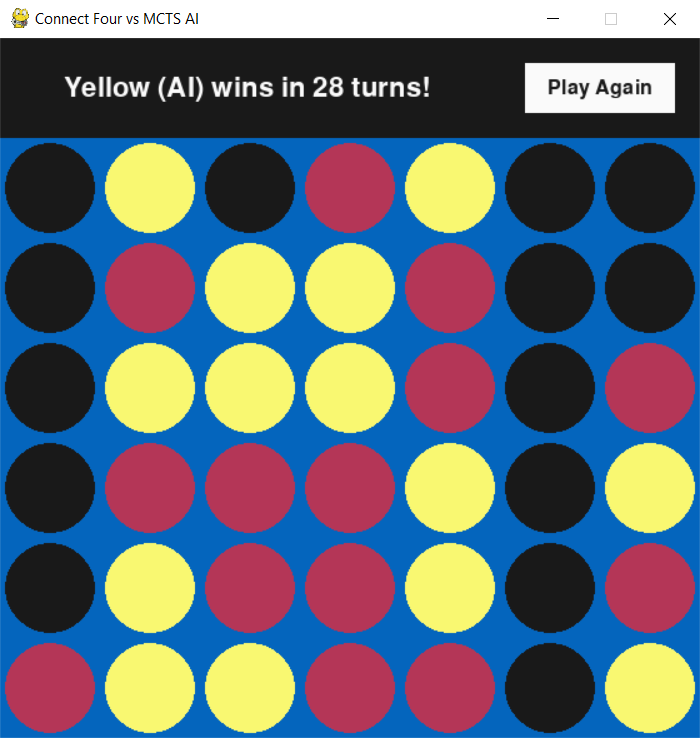

## Connect Four vs Monte Carlo Tree Search algoritm

This is an implementation of Monte Carlo Tree Search in Python for the game Connect Four. This implementation is only suited for two player games but could be modified to work for any two-player zero-sum game. I could have also used Minimax here because of the relatively low branching factor of Connect 4 but instead opted for MCTS.

The graphical interface is a really simple one included to make the game playable outside a CLI.

### How to run:

1. Have python version 3 >= installed
2. Install numpy and pygame
3. In root directory use command: `python runner.py`

_Note: In-game fonts will not render if 'ariel' is not a system font in your environment_

### Features:

- Choose if human or AI player plays first
- Choose AI difficulty (seconds that computer can "think", or how many simulations the algorithm can run)
- Play again

### Screenshot:

